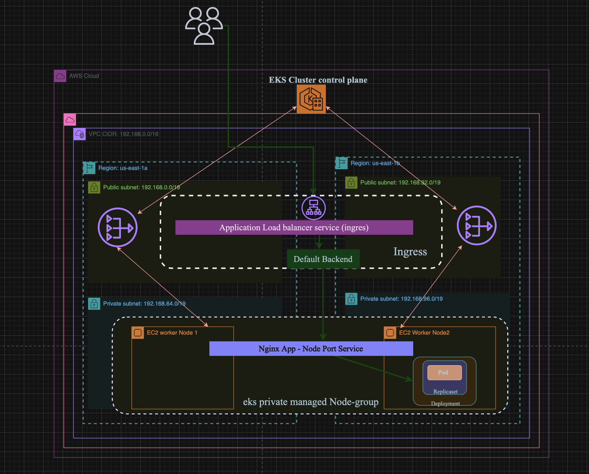

# EKS Cluster and AWS Load Balancer Controller Setup


## Application Architecture which we are going to deploy



I use makefile to simplify the running Command

A Makefile is a powerful tool that simplifies the process of managing and automating complex tasks in software development and system administration. It serves as a build automation tool that orchestrates the execution of commands to streamline the development, deployment, and maintenance processes.

Before running the Makefile, ensure that you have the following prerequisites:

- [eksctl](https://eksctl.io/) installed
- [kubectl](https://kubernetes.io/docs/tasks/tools/install-kubectl/) installed
- [AWS CLI](https://aws.amazon.com/cli/) installed and configured
- [Helm](https://helm.sh/docs/intro/install/) installed
- A valid SSH key pair for SSH access to the nodes

1. **Create EKS Cluster:**

    ```bash
    make create_cluster
    ```

2. **Deploy Private Node Group:**

    ```bash
    make deploy_private_nodegroup
    ```

3. **Create OIDC:**

    ```bash
    make create_oidc
    ```

4. **Create Load Balancer IAM Policy:**

    ```bash
    make create_lb_policy
    ```

5. **Create Service Account:**

    ```bash
    make create_service_account
    ```

6. **Install AWS Load Balancer Controller:**

    ```bash
    make install_aws_loadbalancer
    ```

## Deployment kube-manifest

```yaml
apiVersion: apps/v1
kind: Deployment
metadata:
  name: app-nginx-deployment
  labels:
    app: app-nginx
spec:
  replicas: 1
  selector:
    matchLabels:
      app: app-nginx
  template:
    metadata:
      labels:
        app: app-nginx
    spec:
      containers:
        - name: app-nginx
          image: mahmudarif/k-nginx1:2.0
          ports:
            - containerPort: 80
```

## NodePort Service


```yaml
apiVersion: v1
kind: Service
metadata:
  name: app-nodeport-service
  labels:
    app: app-nginx
  # annotations:
  #  alb.ingress.kubernetes.io/healthcheck-path: /app1/index.html
spec:
  type: NodePort
  selector:
    app: app-nginx
  ports:
    - port: 80
      targetPort: 80 
```


## Ingress Class

```yaml
apiVersion: networking.k8s.io/v1
kind: IngressClass
metadata:
  name: my-ingress-class
  annotations:
    ingressclass.kubernetes.io/is-default-class: "true"
spec:
  controller: ingress.k8s.aws/alb
```

## Ingress kube-manifest with Default Backend Option

```yaml
apiVersion: networking.k8s.io/v1
kind: Ingress
metadata:
  name: eks-ingress
  labels:
    app: app-nginx
  annotations:
    alb.ingress.kubernetes.io/load-balancer-name: my-ingress
    alb.ingress.kubernetes.io/scheme: internet-facing
    
    alb.ingress.kubernetes.io/healthcheck-protocol: HTTP
    alb.ingress.kubernetes.io/healthcheck-port: traffic-port
    alb.ingress.kubernetes.io/healthcheck-path: /app1/index.html
    alb.ingress.kubernetes.io/healthcheck-interval-seconds: '15'
    alb.ingress.kubernetes.io/healthcheck-timeout-seconds: '5'
    alb.ingress.kubernetes.io/success-codes: '200'
    alb.ingress.kubernetes.io/healthy-threshold-count: '2'
    alb.ingress.kubernetes.io/unhealthy-threshold-count: '2'


spec:
  ingressClassName: my-ingress-class
  defaultBackend:
    service:
      name: app-nodeport-service
      port:
        number: 80
```

## Install ingres-class ingress rules nad app components

```bash
  # Navigate to Directory
  basic-ingress-manifest

  # Deploy IngressClass
  make deploy_ingress_class

  # Deploy Application
  make deploy_app

  # Deploy Ingress Rule
  make deploy_ingres_rule

  # Cleanup Components:
  make cleanup_components
```
